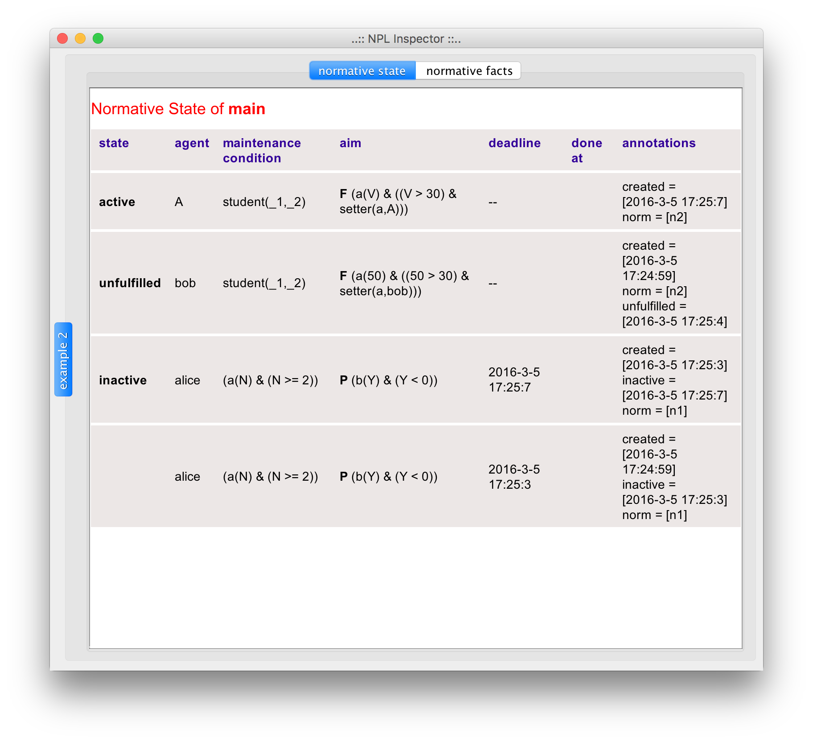

= NPL

Normative Programming Language (NPL) is a language to program norms for multi-agent systems. The language allows us to write norms as follows:
      
	  norm n1
       :  vl(5) & play(alice,boss)
       -> obligation(alice, play(alice,boss), vl(0), `4 seconds`).

that can be read as ``whenever _vl(5) & play(alice,boss)_, Alice is obliged to bring about _vl(0)_  in 4 seconds. If _play(alice,boss)_ ceases to hold, the obligation is dropped.'' The life cycle of obligations can be seen link:./doc/npl-states.pdf[here]. More details are found in papers describing the language (folder link:./doc/publications[publications]) and later in this document.

The folder https://github.com/moise-lang/npl/tree/master/examples[examples] contains Java programs that illustrates how to use the interpreter of NPL.

This language is used to implement the organisational platform for http://moise.sf.net[Moise], called _ORA4MAS_, that is integrated into the https://jacamo-lang.github.io/[JaCaMo] project.

== Installation

Some built releases are available at https://github.com/moise-lang/npl/releases[GitHub]. To build NPL from the source code, use the following commands:

	git clone https://github.com/moise-lang/npl.git
	cd npl
	./gradlew build

To run the examples:

	./gradlew example0
	./gradlew example1
	...



== Norms

Let's have a brief introduction to norms in NPL.

The syntax for a norm that creates obligations is:

```
norm <id>
   : <trigger condition>
  -> obligation(<who>, <while>, <what>, <deadline>)
     [if fulfulled <sanction-rules>]
     [if unfulfulled <sanction-rules>]
     [if inactive <sanction-rules>]
  .
```

Informal semantics: when _<trigger conditions>_ is true, an obligation for _<who>_ is created (the obligation state is _active_, link:./doc/npl-states.pdf[see states]). As soon as _<what>_ is true, the obligation is  _fulfilled_. As soon as _<while>_ is false, the obligation is  _inactive_. As soon as _<deadline>_ is true, the obligation is _unfulfilled_. The deadline can be a temporal expression as `2 seconds` or a state conditions as `full(room)` (in the sense ``is obliged to ... before the room is full").


When the obligation is in a final state (fulfilled, unfulfilled, or inactive), sanction rules, if specified, are evaluated (link:./examples/e4.npl[example]).

The syntax for sanction rules is:
```
sanction-rule <id>(<args>)
   : <condition>
  -> obligation(...).
```
that means ``if _<condition>_ holds, an obligation for someone is created as the consequence of the sanction application.''
Another option for the consequence of sanction rules is:
```
sanction-rule <id>(<args>)
   : <condition>
  -> <fact>.
```
that means ``if _<condition>_ holds, a sanction, represented by _<fact>_, is created and someone/something is supposed to handle that.'' The NPL just produces the sanction fact, its _implementation_ is done by some agent, by the environment, ... This kind of sanction can be used to regiment sanctions.

NPL also provides a special type of norm that produces failures (useful for regimentation of norms). A failure means an unacceptable set of facts that should be reverted. The syntax:

```
norm <id>
   : <trigger condition>
  -> fail(<description>).
```

== NPL Interpreter

The task of the NPL interpreter is to read facts (e.g., from environment, institution, ...) and produce new (normative) facts. At runtime, facts should be provided for interpreter and the current set of produced facts can be consulted.

Facts are used to evaluate _<conditions>_, _<while>_, _<what>_, _<deadline>_, ... expressions in norms and sanction rules.

Facts produced by NPL interpreter are:

- obligations, permissions, and prohibitions for agents as the result of triggering norms. For example `obligation(bob,in_room(bob),present(paper),23h00)`.
- fulfillments and unfulfillments as the result of obligations being in a final state. For example `unfulfilled(obligation(bob,in_room(bob),present(paper),23h00))`

- sanctions as the result of sanction rules. For example: `sanction(fine(bob,100))`.

- failures as the result of triggering norms. For example `fail(in(bob,room))`.

---
Developed by Jomi F. Hubner, Rafael H. Bordini, and Olivier Boissier.
